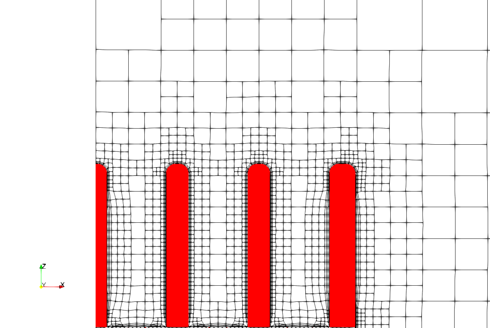

## License

- Commercial use: With author's permission.  
- Academic use (publications, presentations): Please mention the author.

## Author

- Ali Shayegh (aka Maalik) from TensorFields, alishayegh@proton.me

<!---img
    src="tut/curvedFins/figures/1fin.png"
    style="width:fit-content"
/--->

## Gallery

  
  
  
  
  
  
  
  

## What is this?

A mesh generator for the challengin geometry of heatsinks.

## How to use

### Install dependencies

- Install [OpenFOAM-14](https://cfd.direct/openfoam/download/)

### Follow a tutorial

- Go to [this tutorial](./tut/curvedFins/) and follow the [ReadMe.md](./tut/curvedFins/ReadMe.md).