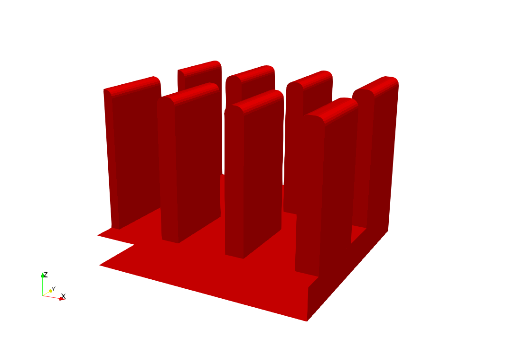
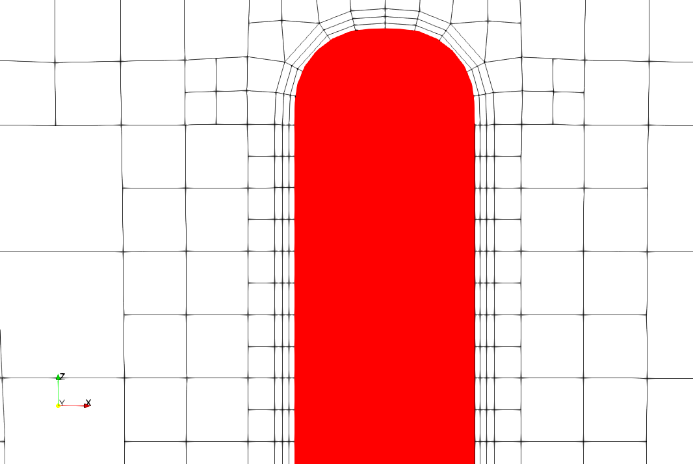
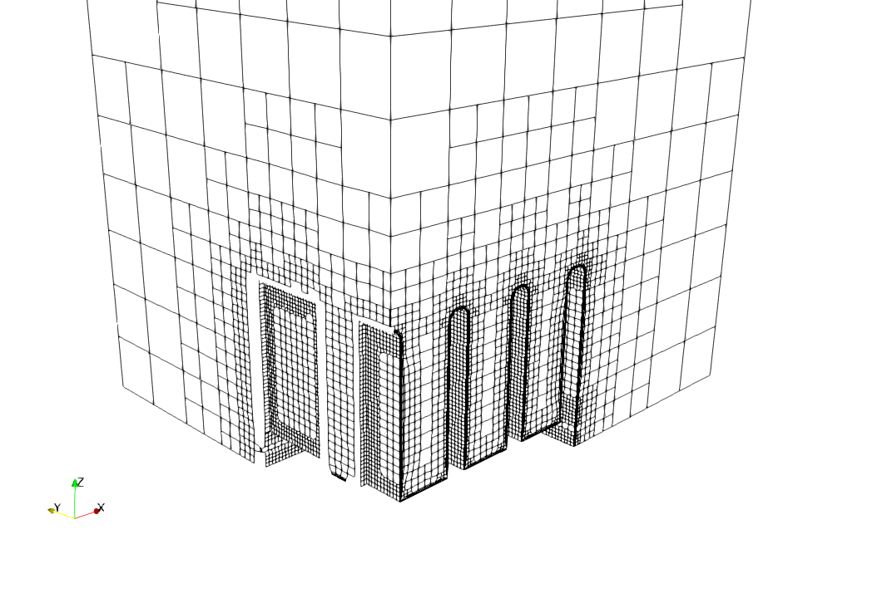
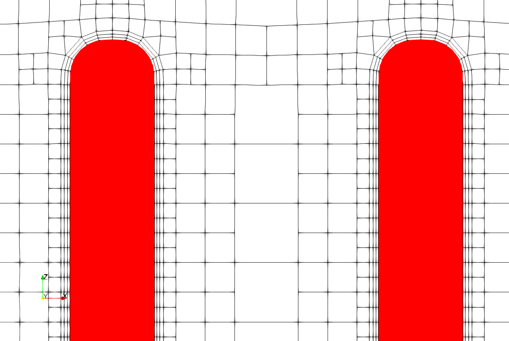
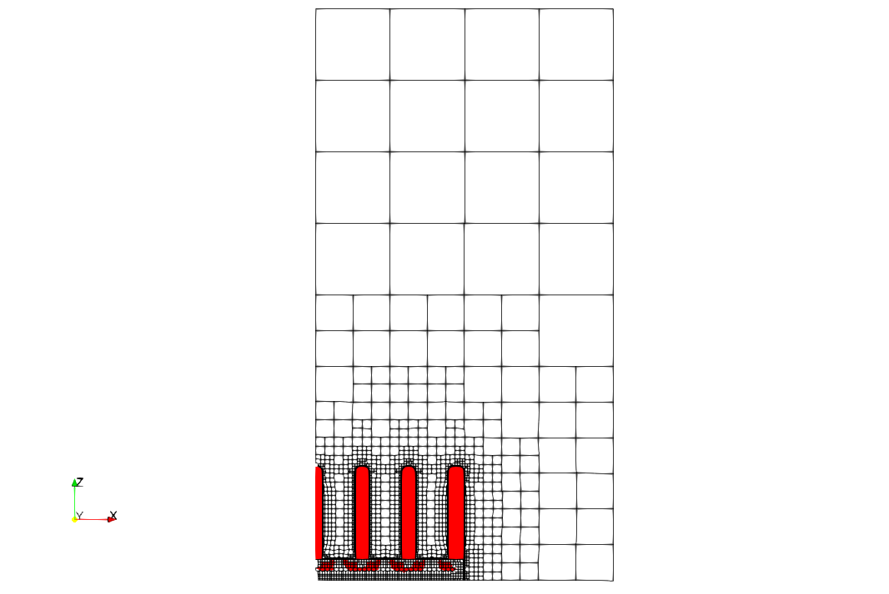
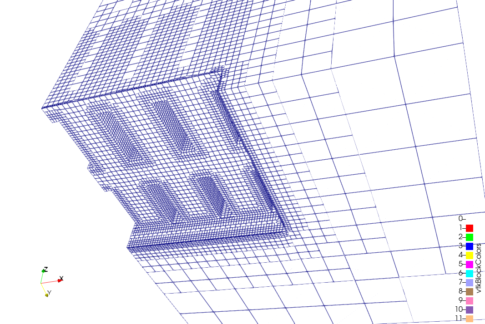
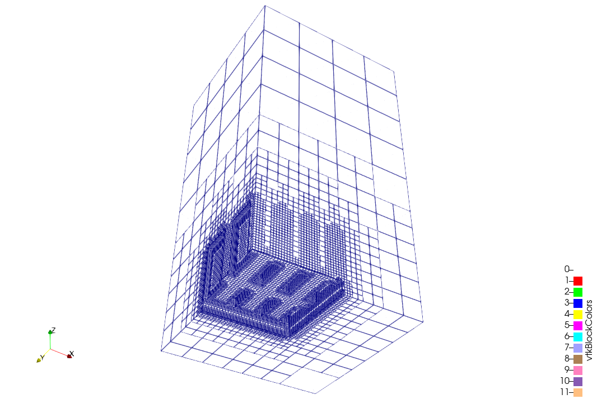

## How to run this test case?

Assuming that you have OpenFOAM-14 installed (lower versions should also work
fine, not tested though),
run the following in your terminal:
```sh
## Create the base mesh.
## Using numbers like 2.017 instead of 2.0 is for the base mesh planes to not
## coincide with the CAD planes, which is important for snappyHexMesh.
./blockMesh.sh -snap minX minY minZ -scales 2.017 2.017 5.017 heatsink.obj

## Create the final mesh
snappyHexMesh

## Visualize in ParaView
paraFoam&

## Optionally, in ParaView, go to File-> Load State-> figures-> state.pvsm
```

## Results

A boundary conforming mesh, with thin layers near the walls (fins), generated
in a matter of seconds.

<div style="display: grid; grid-template-columns: repeat(3, 1fr); gap: 10px; width: 100%;">
  
  
  
  
  
  
  
  
</div>